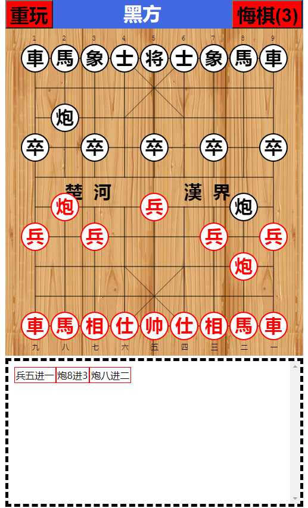

# 前端实现中国象棋
# 演示地址
<a href ="https://yanglinyun.github.io/Chinese-chess/">https://yanglinyun.github.io/Chinese-chess/</a>

# 實現效果UI

# 使用技術: HTML5\CSS3\JS
# 第三方库: 无
# 兼容性: chrome\edge\safari\firefox 移动端百分比响应式
# 简介:
1. 使用前端cavas技术绘制棋盘、棋子
2. 使用js实现走棋规则 与 吃子规则
# 具体功能:
1. 红先黑后
2. 各种棋子下一步可走位置判断并显示可走位置
3. 对 对将、相不能飞出楚河汉界、马走日、兵不能回头等特殊规则均实现
4. 记谱功能实现
5. 使用对象深拷贝实现可悔棋5步
6. 重玩
